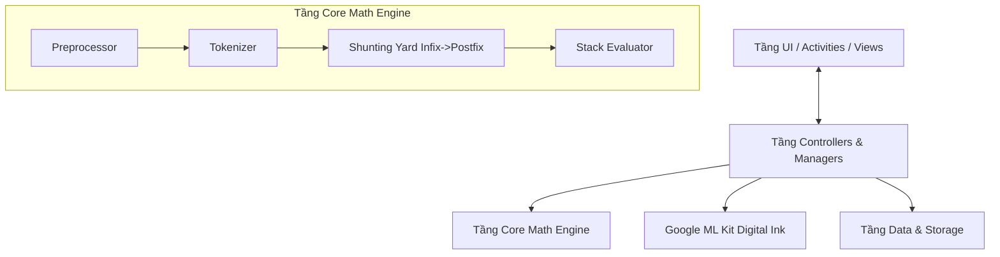

# Báo Cáo Kiến Trúc & Tư Duy Thiết Kế (Architecture & Design Blueprint)

**Dự án:** Ứng dụng Siêu Máy Tính (My Calculator)  
**Nền tảng:** Android (Java)  
**Mô hình Kiến trúc:** MVC (Model - View - Controller) mở rộng.

Tài liệu này cung cấp cái nhìn chuyên sâu và toàn diện nhất về cấu trúc thư mục, các mẫu thiết kế (Design Patterns) được áp dụng, và chi tiết luồng xử lý (Data Flow) của **từng thành phần nhỏ nhất, đến mức độ tên hàm và luồng thuật toán cốt lõi** trong dự án. Tài liệu được thiết kế nhằm giúp các nhà phát triển dễ dàng nắm bắt logic, mở rộng mã nguồn và bảo trì hệ thống ở cấp độ doanh nghiệp (enterprise level).

---

## 1. Tổng Quan Kiến Trúc (Architecture Overview)

Dự án áp dụng chặt chẽ mô hình **MVC** nhằm phân tách rạch ròi 3 tầng trách nhiệm chính. Hệ thống không sử dụng các Framework phức tạp như Dagger/Hilt hay MVVM/LiveData để giữ cho dự án nhẹ, tốc độ khởi động nhanh và code-base thuần túy dễ đọc.

- **Tầng Logic Toán Học & AI (Core & Controller):** Nơi chứa bộ não tính toán (Shunting Yard, Stack Machine) và xử lý AI nhận diện chữ viết tay. Không chứa bất kỳ tham chiếu nào tới giao diện Android.
- **Tầng Giao Diện (UI - View):** Nơi chứa logic hiển thị màn hình (Activities), các View vẽ tùy chỉnh (Canvas) và các Adapter để hiển thị danh sách.
- **Tầng Dữ Liệu (Model & Data):** Nơi xử lý dữ liệu (lịch sử) và lưu trữ cục bộ.

### Sơ Đồ Khối Tổng Thể (System Block Diagram)

---

## 2. Bóc Tách Chi Tiết Các Tầng & Phương Thức Xử Lý (Detailed Method Breakdown)

### A. Tầng Toán Học Cốt Lõi (`core/`)
Đây là bộ não (Engine) của ứng dụng, hoàn toàn độc lập với Android SDK.

1. **`ExpressionConverter.java`**
   - **`tokenize(String expression)`:** 
     - *Nhiệm vụ & Tác dụng:* Phân tách chuỗi biểu thức toán học dạng thô (String) thành các khối logic cơ bản (Token) nhằm chuẩn bị dữ liệu đầu vào sạch sẽ cho hệ thống phân tích. Việc tách rời số nguyên/thập phân, toán tử và hàm số là bước bắt buộc để loại bỏ khoảng trắng và xây dựng cấu trúc cú pháp.
     - *Cách xử lý chi tiết:* Sử dụng vòng lặp `for` duyệt qua từng ký tự `char`. Dùng `StringBuilder` để gộp các số liên tiếp (kiểm tra bằng `Character.isDigit()` hoặc `.` cho số thập phân) thành một Token số nguyên vẹn. Tương tự, gộp các chữ cái (`Character.isLetter()`) thành Token hàm số. Đặc biệt, thuật toán sử dụng cờ trạng thái để phân biệt **dấu trừ nhị phân (Binary Minus `-`)** và **dấu trừ đơn nguyên (Unary Minus `~`)** dựa vào Token đứng ngay trước nó.
   - **`infixToPostfix(List<String> tokens)`:** 
     - *Nhiệm vụ & Tác dụng:* Loại bỏ sự phức tạp của dấu ngoặc và thứ tự ưu tiên (Precedence) bằng cách chuyển đổi biểu thức từ dạng Trung tố (Infix) sang dạng Hậu tố (Postfix / Reverse Polish Notation). Dạng Hậu tố cho phép máy tính đọc tuyến tính và tính toán trực tiếp mà không cần lặp lại.
     - *Cách xử lý chi tiết:* Triển khai thuật toán Shunting Yard của Dijkstra. Khởi tạo một mảng `List<String> output` và một ngăn xếp `Stack<String> operators`. Khi duyệt qua mảng Token: Nếu gặp số $\to$ ném thẳng vào `output`. Nếu gặp hàm $\to$ `push` vào `operators`. Nếu gặp toán tử $\to$ tiến hành so sánh độ ưu tiên (`getPrecedence()`) để rút (pop) các toán tử mạnh hơn hoặc ngang bằng ra khỏi Stack trước khi đưa toán tử mới vào. Dấu ngoặc mở `(` được đẩy vào Stack, dấu ngoặc đóng `)` ép Stack pop liên tục cho tới khi chạm mốc `(`.

2. **`ExpressionEvaluator.java`**
   - **`evaluatePostfix(List<String> postfixTokens)`:**
     - *Nhiệm vụ & Tác dụng:* Đảm nhận vai trò "Bộ não thực thi", xử lý mảng Hậu tố để cho ra kết quả toán học cuối cùng (kiểu Double). Đảm bảo tính toán diễn ra theo đúng thứ tự logic với hiệu suất cao nhất.
     - *Cách xử lý chi tiết:* Đánh giá chuỗi Hậu tố thông qua cơ chế **Máy trạng thái Ngăn xếp (`Stack<Double> stack`)**. Trong quá trình duyệt mảng token:
       - Khối số liệu: Ép kiểu `Double.parseDouble(token)` và đẩy vào ngăn xếp bằng `stack.push(val)`.
       - Khối toán tử 2 ngôi (`+`, `-`, `*`, `/`, `^`): Gọi lệnh `stack.pop()` để trích xuất toán hạng thứ hai (`b`), tiếp tục gọi `stack.pop()` để trích xuất toán hạng thứ nhất (`a`). Thực thi phép tính tương ứng $a \text{ op } b$ và `push` kết quả ngược lại Stack.
       - Khối hàm số 1 ngôi (`sin`, `sqrt`): Rút một giá trị $v$ duy nhất khỏi ngăn xếp, truyền vào hàm chuẩn của Java (ví dụ: `Math.sin(v)`) và `push` kết quả thu được.

3. **`ExpressionValidator.java`**
   - **`validate(String expression)`:**
     - *Nhiệm vụ & Tác dụng:* Hoạt động như một bộ Linter tĩnh, kiểm tra và ngăn chặn các biểu thức lỗi cú pháp (Syntax Error) xâm nhập vào Engine tính toán, giúp ứng dụng hoạt động ổn định và không bị Crash.
     - *Cách xử lý chi tiết:* Trả về đối tượng `Result(boolean valid, String message)`. Trích xuất mảng Token tĩnh từ `ExpressionConverter`. Thiết lập một vòng lặp kiểm tra cặp `prev` và `next` Token kề cận. Hệ thống sẽ bắt các lỗi biên điển hình như: `isBinaryOp(t) && isBinaryOp(next)` (lỗi thiếu toán hạng, ví dụ `+ *`), hoặc kiểm đếm độ sâu (depth counter) để bắt lỗi ngoặc không cân bằng `(` `)`.

4. **`ExpressionPreprocessor.java`**
   - **`normalize(String ocrText)`:**
     - *Nhiệm vụ & Tác dụng:* Chuẩn hóa và khử nhiễu dữ liệu văn bản thô trả về từ AI (Google ML Kit). Do chữ viết tay thường thiếu tính chặt chẽ, bộ tiền xử lý này giúp dịch các nét viết tắt (như `2(3)`) thành cú pháp toán học chuẩn để máy tính hiểu được.
     - *Cách xử lý chi tiết:* Thực thi tuần tự qua 4 bước: (1) Gọi `replaceAll("\\s+", "")` để xóa hoàn toàn khoảng trắng. (2) Gọi `endsWith("=")` để cắt bỏ dấu bằng thừa thãi ở cuối câu. (3) Định tuyến lại biến số `x` thành toán tử nhân `*`. (4) Giải quyết nhân ẩn (Implicit Multiplication) thông qua vòng lặp duyệt chuỗi: Nếu phát hiện ký tự hiện tại `currIsDigit` đi liền kề ngay sau là `nextIsOpeningParen` `(`, thuật toán sẽ tự động chèn ký tự `*` vào giữa `StringBuilder`. 

5. **`FunctionParser.java`**
   - **`isFunction(String token)`**: 
     - *Nhiệm vụ & Tác dụng:* Định nghĩa thư viện hằng số và bộ tra cứu (Dictionary), giúp hệ thống nhận diện nhanh chóng các hàm toán học chuyên dụng.
     - *Cách xử lý chi tiết:* Sử dụng cơ chế cấu trúc rẽ nhánh (`switch-case`) để xác định chuỗi ký tự thô có thuộc tập hợp hàm hợp lệ hay không (`sin`, `cos`, `tan`, `log`, `ln`, `sqrt`).

### B. Tầng Trình Điều Khiển & Hỗ Trợ (`controller/` & `helper/`)

1. **`MathInkManager.java` (Facade & Asynchronous AI Manager)**
   - **`downloadModel(Context, OnModelDownloadListener)`:** 
     - *Nhiệm vụ & Tác dụng:* Tải và khởi tạo mô hình trí tuệ nhân tạo nhận diện chữ viết về máy để đảm bảo ứng dụng có thể phân tích nét chữ trơn tru ở chế độ ngoại tuyến (Offline) mà không cần mạng lưới đám mây.
     - *Cách xử lý chi tiết:* Khởi tạo dịch vụ `RemoteModelManager`. Định cấu hình bộ tiêu chuẩn tải về qua `DownloadConditions` (Yêu cầu mạng Wifi/3G). Điều hướng tiến trình tải mô hình `"en"` xuống Background Thread nhằm tránh gây nghẽn luồng giao diện chính (Main UI Thread).
   - **`recognize(Ink ink, OnResultListener)`:** 
     - *Nhiệm vụ & Tác dụng:* Chuyển đổi các quỹ đạo nét vẽ của ngón tay/bút cảm ứng thành chuỗi ký tự toán học có thể định dạng được.
     - *Cách xử lý chi tiết:* Trích xuất model offline đã nạp vào RAM, khởi tạo thể hiện của lớp `DigitalInkRecognizer`. Truyền đối tượng `Ink` (tập hợp các Vector điểm tọa độ không gian) vào phương thức `recognizer.recognize(ink)`. Cài đặt callback `addOnSuccessListener` để nhận chuỗi văn bản phân giải (ví dụ `"2+2"`) hoặc cài `addOnFailureListener` để bắt cảnh báo nếu luồng AI gặp sự cố.

2. **`MainActivityController.java` & `MainUiShellController.java`**
   - **`handleButtonClick(String command)`:** 
     - *Nhiệm vụ & Tác dụng:* Tiếp nhận tín hiệu từ các phím vật lý ảo trên giao diện Máy tính và phân luồng chỉ thị tương ứng (Gõ số, Xóa, Bằng).
     - *Cách xử lý chi tiết:* Phân tích cấu trúc lệnh tĩnh từ UI. Nếu tín hiệu nhận được là `C`, kích hoạt `inputManager.clear()`. Nếu tín hiệu là `=`, tiến hành gọi `evaluate()` để khởi động Core Engine và kích hoạt đồng thời `HistoryManager.saveHistory()` để ghi log cục bộ. 
   - **`openMathNote(Context context, int orientation)`:** 
     - *Nhiệm vụ & Tác dụng:* Trình định tuyến điều hướng (Navigation Router), cho phép chuyển đổi không độ trễ giữa Máy tính truyền thống và Màn hình Nhận diện Viết tay.
     - *Cách xử lý chi tiết:* Khởi tạo đối tượng `Intent` của Android, đóng gói các cờ vòng đời (Lifecycle Flags) và dữ liệu Extra để chuyển hướng Context an toàn sang thực thể `MathNoteActivity`.

### C. Tầng Giao Diện (UI - `ui/`)

1. **`DrawingView.java` (Cốt lõi xử lý Đa chạm & Render đồ họa)**
   - **`onTouchEvent(MotionEvent event)`:** 
     - *Nhiệm vụ & Tác dụng:* Bắt trọn mọi tương tác chạm (Touch) của người dùng trên bề mặt thiết bị để dựng nên các nét mực kỹ thuật số trực quan.
     - *Cách xử lý chi tiết:* Trích xuất trạng thái chạm qua `event.getActionMasked()`.
       - `ACTION_DOWN`: Khởi tạo một `Path` đồ họa mới và một đối tượng `StrokeBuilder` nội bộ.
       - `ACTION_MOVE`: Xử lý mượt nét vẽ bằng cách nội suy đường cong Bezier. **Điểm mấu chốt**: Chuyển đổi ma trận tọa độ màn hình (Screen) về tọa độ thế giới (World) bằng công thức $x_{world} = (x_{screen} - translateX) / scaleFactor$ trước khi chèn vào `StrokeBuilder`. Phép biến đổi toán học này triệt tiêu hoàn toàn sự sai lệch, đảm bảo AI nhận dạng nét chính xác 100% kể cả khi người dùng đang thu phóng (Zoom) hay di chuyển không gian (Pan).
   - **`ScaleGestureDetector.SimpleOnGestureListener`:** 
     - *Nhiệm vụ & Tác dụng:* Hỗ trợ điều hướng không gian Canvas vô cực bằng cử chỉ cảm ứng đa điểm của Android.
     - *Cách xử lý chi tiết:* Bắt sự kiện Pinch-to-Zoom (2 ngón tay thu phóng). Tính toán và cập nhật biến số vô hướng `scaleFactor` đồng thời dịch chuyển trục hệ tọa độ tương ứng của ma trận Canvas.
   - **Thuật toán Xóa thông minh (Smart Eraser Collision Engine):** 
     - *Nhiệm vụ & Tác dụng:* Thay vì xóa đứt đoạn từng pixel đồ họa, tính năng Tẩy xóa hoạt động ở cấp độ Vector thông minh, giúp gỡ bỏ trọn vẹn cả một nét vẽ chỉ bằng một cú lướt chạm.
     - *Cách xử lý chi tiết:* Khi hệ thống đang ở trạng thái `Mode.ERASE`, thuật toán kích hoạt vòng lặp tính toán khoảng cách Euclidean (áp dụng Định lý hình học Pytago): $d = \sqrt{(x_{world} - x_{stroke})^2 + (y_{world} - y_{stroke})^2}$. Nếu nhận thấy $d \le ERASER\_RADIUS / scaleFactor$, đối tượng `StrokeItem` đó lập tức bị loại khỏi danh sách bộ nhớ. Phương thức `invalidate()` được kích hoạt để vẽ lại Canvas trống, ngay sau đó hàm `recognize()` của AI được gọi tự động ngầm dưới nền để cung cấp lại kết quả biểu thức mới nhất.

2. **`GraphView.java`**
   - **`onDraw(Canvas canvas)`:** 
     - *Nhiệm vụ & Tác dụng:* Đảm nhận vai trò trực quan hóa phương trình toán học khô khan dưới dạng đường cong đồ thị 2D trên mặt phẳng tọa độ Descartes.
     - *Cách xử lý chi tiết:* Gọi phương thức `canvas.drawLine()` để khởi tạo hệ trục tọa độ Ox, Oy chia lưới (Grid). Thực hiện lặp tịnh tiến theo giá trị trục X, ánh xạ tọa độ bằng cách tính $y = f(x)$ thông qua module `ExpressionEvaluator` với biến động $x$. Cập nhật tọa độ sang Pixel màn hình tương ứng và render đường cong liên tục.

### D. Tầng Dữ Liệu (`data/` & `model/`) & Cấu hình Hệ thống
1. **`HistoryManager.java`**
   - **`saveHistory(List<HistoryItem>)` / `loadHistory()`:** Gọi `context.getSharedPreferences()`. Khởi tạo `Gson().toJson(list)` để biến mảng Java thành một chuỗi JSON thuần túy để ghi vào ổ cứng, và `Gson().fromJson(jsonString, typeToken)` để lấy lại mảng khi khởi động lại app.
2. **Cấu Hình `AndroidManifest.xml`**
   - Cài đặt `android:screenOrientation="behind"` giúp khung cửa sổ mượn hướng xoay của Activity phía sau (MainActivity) trước khi Activity mới kịp OnCreate, triệt tiêu lỗi nhấp nháy màn hình đen (Screen flicker).
   - Cài đặt `android:configChanges="orientation|screenSize|keyboardHidden"` thông báo cho Android OS: *"Không được destroy và tạo lại Activity này khi xoay màn hình"*. Điều này giữ cho biến đối tượng `DrawingView` và toàn bộ lịch sử nét vẽ Vector còn nguyên vẹn trên Canvas RAM.

---

## 3. Luồng Xử Lý Nghiệp Vụ Điển Hình (Business Logic Flows)

### Flow 1: Tính Toán Trên Máy Tính Truyền Thống (`MainActivity`)
1. **Sự kiện:** Người dùng bấm nút `+` $\to$ Gọi `KeyMappingContext` định tuyến $\to$ `CalculatorInputManager` chèn ký tự `+` vào màn hình.
2. **Thực thi:** `MainActivityController` được kích hoạt, gửi chuỗi `1+` vào `ExpressionValidator`.
3. **Phân tích:** `Validator` trả về lỗi "Biểu thức chưa hoàn chỉnh" $\to$ UI bỏ qua.
4. **Tiếp tục:** Người dùng bấm `2`. Chuỗi `1+2` được đưa qua `ExpressionConverter` biến thành Hậu tố `1 2 +`.
5. **Tính toán:** `ExpressionEvaluator` giải mã ngăn xếp $\to$ Kết quả: `3`. Controller hiển thị `3` lên màn hình.

### Flow 2: Nhận Diện Chữ Viết Tay AI (Math Note - `MathNoteActivity`)
1. **Input:** Người dùng chạm bút/ngón tay lên `DrawingView`. `onTouchEvent` ghi nhận quỹ đạo ngón tay.
2. **World Transform:** Tọa độ ngón tay trên màn hình $(x, y)$ được nội suy nghịch đảo (Inverse Matrix) về không gian thực (World Space) $\to$ Đóng gói vào đối tượng Builder của Google: `Ink.Stroke.Builder`.
3. **AI Inference:** `MathInkManager.recognize()` gửi đối tượng `Ink` vào ML Kit Model. Thuật toán phân tích tọa độ $(X, Y)$ kết hợp Timestamp $T$ của nét vẽ, trả về chuỗi văn bản nhận dạng: `"1 + 1 / 2"`.
4. **Preprocessing:** `ExpressionPreprocessor.normalize()` bắt lỗi và chuẩn hóa chuỗi $\to$ `"1+1/2"`.
5. **Evaluation:** Tầng Core áp dụng Shunting Yard + Stack để giải mã thành kết quả $\to$ `1.5`.
6. **Render:** Dòng chữ `"Calculated: 1 + 1 / 2 = 1.5"` được ném lên TextView hiển thị tại thanh Bottom Floating Status Pill trên màn hình.

### Flow 3: Xóa Nét Vẽ Bằng Tẩy Thông Minh (Smart Eraser)
1. **Trạng thái:** Người dùng chọn chế độ `Mode.ERASE` trên thanh công cụ và quét ngón tay qua Canvas.
2. **Collision Engine:** Hàm `checkEraserCollision(x, y)` thuộc `DrawingView` lặp qua danh sách lịch sử các `StrokeItem`. Tại mỗi điểm chạm, hệ thống đo khoảng cách hình học tới tất cả các đỉnh của nét vẽ bằng `Math.hypot()`.
3. **Thực thi Xóa:** Nếu Khoảng cách điểm chạm nhỏ hơn Bán kính tẩy (Radius), toàn bộ nét vẽ đó (và thuộc tính Ink liên kết) lập tức bị ném khỏi mảng. `invalidate()` được gọi để xóa nét trên UI.
4. **Re-evaluate:** Ngay sau khi nét bị xóa, `MathNoteActivity` khởi động lại hàm `MathInkManager.recognize()` với cụm nét vẽ còn sót trên màn hình và tự động đẩy qua Engine để cập nhật lại kết quả tính toán mới tức thì.

---

## 4. Các Mẫu Thiết Kế Áp Dụng (Design Patterns & Principles)

Trong quá trình phát triển, dự án đã bám sát bộ nguyên tắc **SOLID** và áp dụng nhiều Design Pattern để tối ưu hóa khả năng bảo trì:

1. **Facade Pattern (Mẫu thiết kế Mặt tiền):**
   - Áp dụng tại lớp `MathInkManager`. Thay vì để UI Controller phải tự định nghĩa Callback, xử lý các Exception rườm rà của Google API, định nghĩa Model Identifier, tải Model, v.v., Facade đã che giấu mọi sự phức tạp đó đằng sau 3 phương thức đơn giản: `init()`, `downloadModel()`, và `recognize()`. UI chỉ gọi và nhận Data.
2. **State Pattern (Mẫu thiết kế Trạng thái):**
   - Áp dụng tại `DrawingView.Mode`. Thay vì dùng hàng đống lệnh `if-else` lồng nhau trong sự kiện Touch (`ACTION_DOWN`, `ACTION_MOVE`) để xem người dùng đang vẽ hay xóa, biến Enum `currentMode` (`DRAW` / `ERASE`) giúp đóng gói hành vi Touch cực kỳ sạch sẽ và dễ dàng mở rộng (nếu tương lai có thêm chế độ `SELECT` hay `LASSO`).
3. **Observer / Listener Pattern:**
   - Dùng xuyên suốt trong kiến trúc bất đồng bộ (Asynchronous Callback Interface). Khi AI đang bận suy luận hoặc tải dữ liệu ở luồng nền (Background thread), Main UI Thread không bị treo/đứng máy. Khi có kết quả, sự kiện được Listener đẩy về UI ngay lập tức.
4. **Single Responsibility Principle (Nguyên tắc Đơn trách nhiệm - SOLID):**
   - Mỗi file đảm nhiệm đúng 1 và chỉ 1 mục đích:
     - `ExpressionConverter`: Chỉ chuyên tách Token (`tokenize`) và định dạng thuật toán (`infixToPostfix`). Không dính dáng đến tính toán hay Lỗi.
     - `ExpressionEvaluator`: Chỉ nhận mảng Hậu tố và nhả ra con số `Double`.
     - Lớp Controller lo logic; Lớp Custom View (Canvas) chỉ lo vẽ hình ảnh lên Pixel màn hình.
5. **Static Utility Classes:**
   - Các lớp toán học (`ExpressionValidator`, `ExpressionPreprocessor`, `FunctionParser`) được thiết kế tĩnh (Static methods). Điều này giúp hệ thống không tốn bộ nhớ khởi tạo các đối tượng vô ích (`new ExpressionValidator()`) (Zero Instantiation Overhead), đạt chuẩn tốc độ thực thi tức thì $O(1)$ Memory Overhead.

---
*(Tài liệu này được soạn thảo chi tiết nhằm phục vụ công tác bàn giao mã nguồn, cấu trúc thuật toán cấp thấp, đào tạo nội bộ và bảo trì dài hạn.)*
